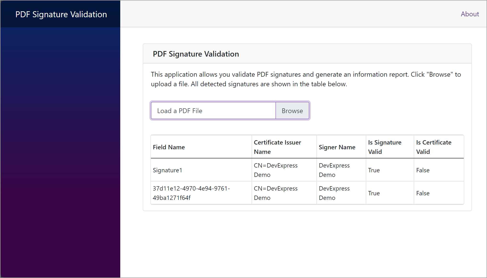

<!-- default badges list -->

<!-- default badges end -->
# PDF Document API – Validate Document Signatures

The following code sample project shows how to use the PDF Document API to generate signature validation reports.

Click **Browse** to load a PDF file. If the file contains signatures, the table will include all signature information.

## Implementation Details

The [GetSignatureInfo](https://docs.devexpress.com/OfficeFileAPI/DevExpress.Pdf.PdfDocumentSigner.GetSignatureInfo) method retrieves all signatures contained in the PDF file. Each signature from the obtained list is then passed as the `GenerateInfoList` method parameter. This method retrieves the signature name, signer’s name and certificate information to generate an information list. The [VerifySignature](https://docs.devexpress.com/OfficeFileAPI/DevExpress.Pdf.PdfPkcs7Signature.VerifySignature) method verifies the signature validity. The resulting list is then shown in the [DxDataGrid](https://docs.devexpress.com/Blazor/DevExpress.Blazor.DxDataGrid-1?) table.

## Files to Review

* [Index.razor](./CS/Pages/Index.razor)

## Documentation

* [How to: Validate a PDF Document Signature](https://docs.devexpress.com/OfficeFileAPI/404728/pdf-document-api/examples/document-protection/how-to-validate-a-pdf-document-signature)

## More Examples

* [PDF Document API - Sign a PDF Document with a Certificate Stored on a Hardware Device](https://github.com/DevExpress-Examples/pdf-document-api-sign-documents-with-certificate)
* [PDF Document API - Use the Azure Key Vault API to Sign a PDF Document](https://github.com/DevExpress-Examples/pdf-document-api-use-azure-key-vault-api-to-sign-document)
* [PDF Document API - Apply Multiple Signatures](https://github.com/DevExpress-Examples/pdf-document-api-multiple-signatures)
